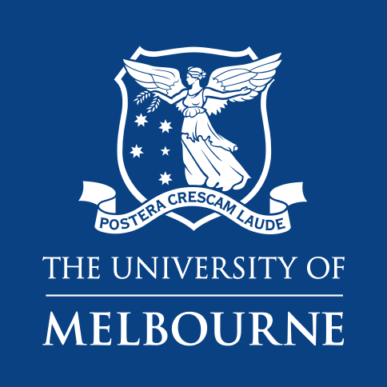

# We use four main AI-related techniques shows as follow(see in Wiki for details):

** 1.Astar Algorithm

** 2.Value Iteration Algorithm

** 3.Q-Learning Algorithm

** 4.Goal Recognition Technique

# Pacman Capture the Flag Project Template

You must read fully and carefully the assignment specification and instructions detailed in this file. You are NOT to modify this file in any way.

* **Course:** [COMP90054 AI Planning for Autonomy](https://handbook.unimelb.edu.au/subjects/comp90054) @ Semester 2, 2020
* **Instructor:** Dr. Nir Lipovetzky and Prof. Adrian Pearce
* **Deadline Preliminary Submission:** Monday 12 October, 2020 @ 11:59pm (start of Week 10)
* **Deadline Wiki & Final Submission:** Monday 26th October, 2020 @ 11:59pm (start of Week 12)
* **Deadline Video Submission:** Thursday 29th October, 2020 @ 11:59pm (Week 12)
* **Course Weight:** 10% (preliminary competition) + 15% (final competition) + 10% (video) + 10% (Wiki)
* **Assignment type:**: Groups of 3 or 4
* **CLOs covered:** 1-5
* **Submission method:** via git tagging (see below for instructions)

The purpose of this project is to implement a Pacman Autonomous Agent that can play and compete in the UoM COMP90054-2020 _Pacman Capture the Flag tournament_:

 
 
    
    
 

 
Note that the Pacman tournament has different rules as it is a game of two teams, where your Pacmans become ghosts in certain areas of the grid. Please read carefully the rules of the Pacman tournament. Understanding it well and designing a controller for it is part of the expectations for this project. Additional technical information on the contest project can be found in file [CONTEST.md](CONTEST.md). 

## Your task

This is a **group project** of 3 or 4 members. Now that you have a repo, the next thing to do is to register your team in the [Project Contest Team Registration Form](https://forms.gle/ViZvqoCVfVBHmfGA8) and tell the other students to join the team in GitHub Classroom. 

**Your task** is to develop an autonomous Pacman agent team to play the [Pacman Capture the Flag Contest](http://ai.berkeley.edu/contest.html) by suitably modifying file `myTeam.py` (and maybe some other auxiliarly files you may implement). The code submitted should be internally commented at high standards and be error-free and _never crash_. 

In your solution, you have to use at **least 2 AI-related techniques** (**3 techniques at least for groups of 4**) that have been discussed in the subject or explored by you independently, and you can combine them in any form. **We won't accept a final submission with less than 2/3 techniques**. Some candidate techniques that you may consider are:

1. Blind or Heuristic Search Algorithms (using general or Pacman specific heuristic functions).
2. Classical Planning (PDDL and calling a classical planner).
3. Policy iteration or Value Iteration (Model-Based MDP).
4. Monte Carlo Tree Search or UCT (Model-Free MDP).
5. Reinforcement Learning – classical, approximate or deep Q-learning (Model-Free MDP).
6. Goal Recognition techniques (to infer intentions of opponents).
7. Game Theoretic Methods.

We recommend you to start by using search algorithms, given that you already implemented their code in the first project. You can always use hand coded decision trees to express behaviour specific to Pacman, but they won't count as a required technique. You are allowed to express domain knowledge, but remember that we are interested in "autonomy", and hence using techniques that generalise well. The 7 techniques mentioned above can cope with different rules much easier than any decision tree (if-else rules). If you decide to compute a policy, you can save it into a file and load it at the beginning of the game, as you have 15 seconds before every game to perform any pre-computation. If you want to use classical planning, I recommend reading [these tips](CONTEST.md#pac-man-as-classical-planning-with-pddl).

Together with your actual code solution, you will need to develop a **Wiki**, documenting and describing your solution (a 5-min recorded video will also be required, see below).
 
### Important basic rules 

When submitting a solution, please make absolutely sure you adhere to the following rules:

* Your code **must run _error-free_ on Python 3.6**. Staff will not debug/fix any code. If your code crashes in any execution, it will be disqualified from the contest.
    * You can install Python 3.6 from the [official site](https://www.python.org/dev/peps/pep-0494/), or set up a [Conda environment](https://www.freecodecamp.org/news/why-you-need-python-environments-and-how-to-manage-them-with-conda-85f155f4353c/) or an environment with [PIP+virtualenv](https://uoa-eresearch.github.io/eresearch-cookbook/recipe/2014/11/26/python-virtual-env/). See also [this question in the FAQ](FAQ.md#how-do-i-setup-a-system-in-windows-with-python-36).

* Your code **must not contain any personal information**, like your student number or your name. That info should go in the [TEAM.md](TEAM.md) file, as per instructions below. If you use an IDE that inserts your name, student number, or username, you should disable that.

* You are **not to change or affect (e.g., redirect) the standard output or error channels** (`sys.stdout` and `sys.stderr`) beyond just printing on standard output. If your file mentions any of them it will be breaking the "fair play" of the course (see below). These are used to report each game output and errors, and they should not be altered as you will be interfering negatively with the contest and with the other team's printouts. 

* Being a group assignment, you must **use your project Github** repository and GitHub team to collaborate among the members. The group will have write access to the same repository, and also be members of a GitHub team, where members can, and are expected to, engage in discussions and collaboration. Refer to the marking criteria below. 

## Inter-University Competition

The top teams of the final tournament will be inducted to the [RMIT-UoM Pacman Hall of Fame](https://sites.google.com/view/pacman-capture-hall-fame/) and will qualify to the yearly championship across RMIT and The University of Melbourne, which runs every year with the best teams since 2017 onward (given you grant us permission, of course). This is just "for fun" and will attract no marks, but is something that previous students have stated in their CVs!

### Acknowledgements

This is [Pacman Capture the Flag Contest](http://ai.berkeley.edu/contest.html) from the set of [UC Pacman Projects](http://ai.berkeley.edu/project_overview.html).  We are very grateful to UC Berkeley CS188 for developing and sharing their system with us for teaching and learning purposes.
